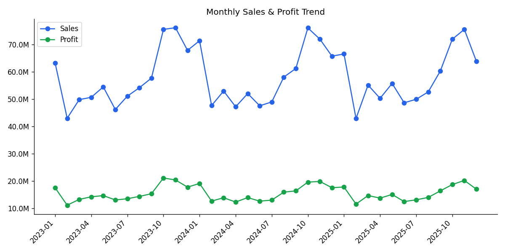
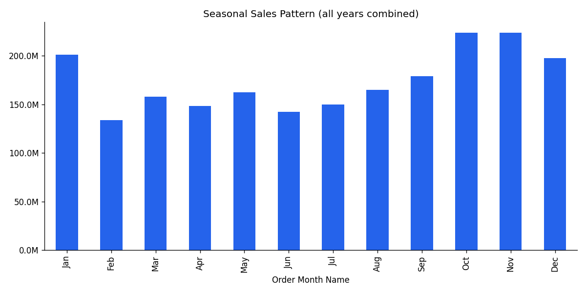
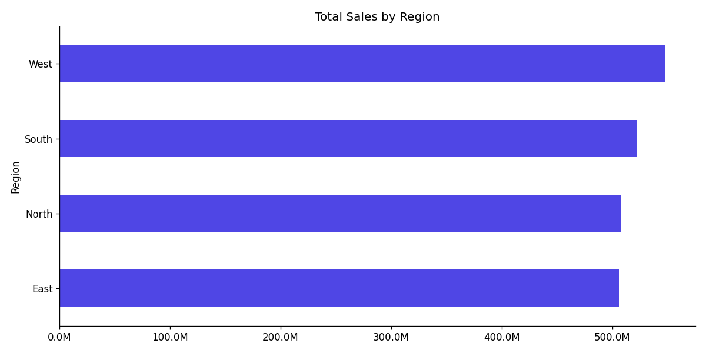
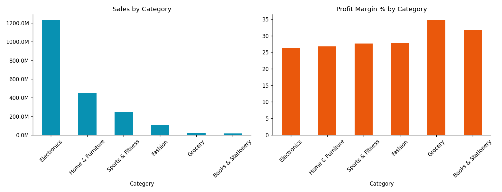
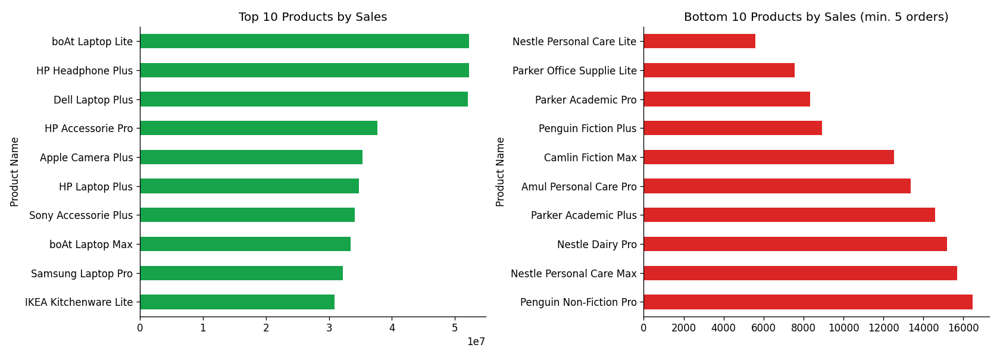
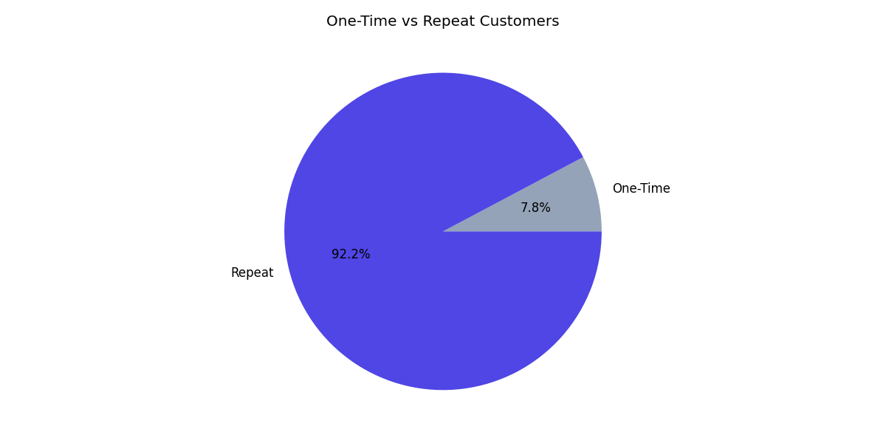
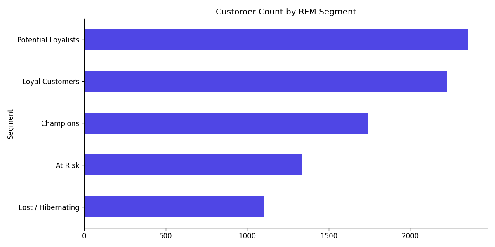
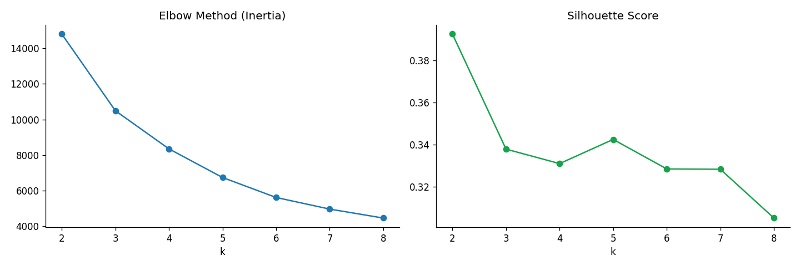
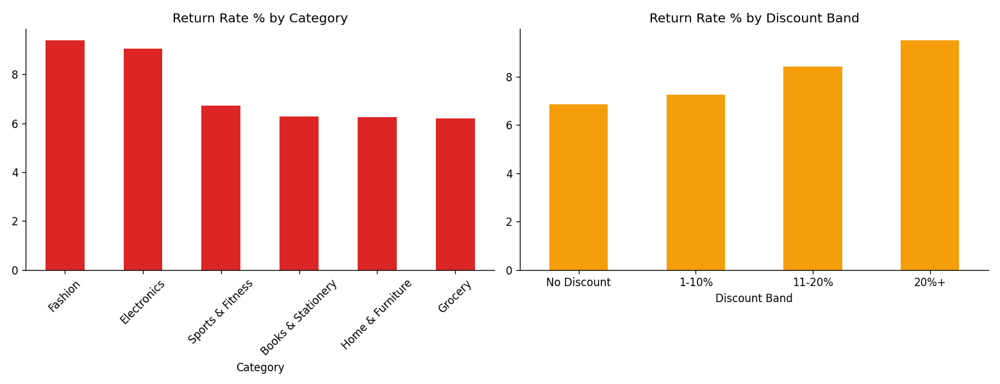
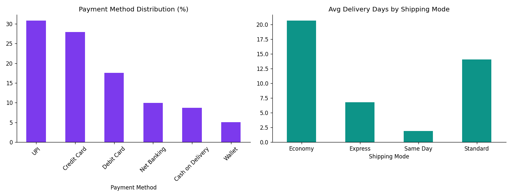

<p align="center">
  
</p>

# 🛒 Retail Sales Data Analysis

An end-to-end data analytics project on a simulated pan-India retail chain (2023–2025).
It covers the **complete analyst workflow**: generating messy raw data → cleaning it →
analyzing it with SQL and Python → building customer segments with machine learning →
presenting everything in an executive dashboard and business report.

> **In one line:** take a messy 60,000-row sales export and turn it into clear,
> decision-ready business insights.

---

## 📌 Key Numbers at a Glance

| KPI | Value |
|---|---|
| 💰 Total Sales | ₹208.4 Cr |
| 📈 Total Profit | ₹55.9 Cr (26.8% margin) |
| 🧾 Total Orders | 57,718 |
| 👥 Total Customers | 8,767 |
| 🛍️ Average Order Value | ₹36,106 |
| 🔁 Return Rate | 7.4% |

---

## 🔄 How the Project Flows

The project is built in five simple stages. Each stage produces files the next stage uses.

```
1. GENERATE          2. CLEAN               3. ANALYZE                4. SEGMENT             5. PRESENT
raw messy CSV   →    clean CSV +       →    SQL queries +       →    RFM scores +      →    dashboard +
(60,320 rows)        cleaning log           Python EDA charts        K-Means clusters       reports
```

| Stage | What happens | Where to look |
|---|---|---|
| **1. Generate** | Create a realistic but intentionally messy dataset (duplicates, missing values, bad dates, outliers) | `scripts/01_generate_dataset.py` |
| **2. Clean** | Fix every data-quality issue and log each fix with row counts | `scripts/02_clean_dataset.py`, `reports/data_cleaning_log.md` |
| **3. Analyze** | 36 SQL queries + full Python EDA (trends, regions, categories, products, returns) | `sql/retail_sales_analysis.sql`, `notebooks/Retail_Sales_Analysis.ipynb` |
| **4. Segment** | Score customers with RFM and cluster them with K-Means | `data/customer_rfm.csv`, notebook |
| **5. Present** | Interactive executive dashboard + written business reports | `retail_executive_dashboard.html`, `reports/` |

---

## 📊 Key Insights (with Charts)

### 1. Sales grow steadily, with a clear festive spike every year

Sales and profit move together across all three years. Every year, sales jump
sharply in **October–November** (the Indian festive season) and dip in the
February and summer months.



Combining all years into one seasonal view makes the pattern obvious — October
and November are ~35–40% above the slowest months:



**Takeaway:** plan inventory, staffing, and marketing spend around the Oct–Nov peak.

---

### 2. All four regions sell almost equally — West leads slightly

West and South are ahead, but the gap is small and profit margins are nearly
identical everywhere (~26–27%). Growth is a **volume** opportunity, not a
margin problem in any region.



---

### 3. Electronics is the revenue engine; Grocery has the best margin %

Electronics alone brings in ~59% of all sales. But margin % tells a different
story — smaller categories like **Grocery (~35%)** and **Books & Stationery (~32%)**
earn more profit per rupee sold.



**Takeaway:** Electronics drives the top line; high-margin categories are where
each extra sale is most profitable.

---

### 4. Laptops dominate the best-seller list

The top products are almost all Electronics (laptops, headphones, accessories),
while the slowest sellers are mostly Grocery and Books items.



---

### 5. Repeat customers are the business

**92% of customers buy more than once**, and they generate the large majority of
revenue. Keeping existing customers happy matters more here than acquiring new ones.



---

### 6. Customers fall into 5 actionable segments (RFM + K-Means)

Each customer is scored on **R**ecency (how recently they bought),
**F**requency (how often), and **M**onetary value (how much they spend), then
grouped into marketing-ready segments:



| Segment | Who they are | What to do |
|---|---|---|
| 🏆 Champions | Recent, frequent, big spenders | Reward and retain |
| 💙 Loyal Customers | Buy regularly | Upsell and cross-sell |
| 🌱 Potential Loyalists | Newer, promising | Nurture into loyalty |
| ⚠️ At Risk | Used to buy, going quiet | Win-back campaigns |
| 💤 Lost / Hibernating | Long inactive | Low-cost reactivation only |

The number of K-Means clusters was chosen using the elbow method and silhouette
score (an interactive 3D view of the clusters is in `images/kmeans_3d_clusters.html`):



---

### 7. Deep discounts drive returns, not just lower margins

**Fashion (9.4%)** and **Electronics (9.0%)** have the highest return rates.
More interesting: return rate **climbs with discount depth** — orders discounted
20%+ get returned far more often than full-price orders. Aggressive discounting
hurts twice: it compresses margin *and* increases returns.



---

### 8. UPI is the top payment method; shipping speed barely affects returns

UPI (~31%) and Credit Card (~28%) dominate payments. Delivery speed ranges from
~2 days (Same Day) to ~21 days (Economy), yet return rates stay in a narrow
7.4–7.7% band across all shipping modes — **delivery speed is not a major
return-rate lever**.



---

## 📁 Project Structure

```
Retail-Sales-Data-Analysis/
├── data/
│   ├── retail_sales_raw.csv             # 60,320 rows — intentionally messy source data
│   ├── retail_sales_clean.csv           # 58,799 rows — analysis-ready dataset
│   ├── retail_sales.db                  # SQLite database built from the clean data
│   ├── customer_rfm.csv                 # RFM scores + K-Means cluster per customer
│   └── daily_sales_timeseries.csv       # Daily sales series, ready for forecasting
├── sql/
│   └── retail_sales_analysis.sql        # 36 queries — aggregates, window functions, CTEs, CLV
├── notebooks/
│   └── Retail_Sales_Analysis.ipynb      # Full Python EDA + RFM + K-Means + forecasting prep
├── scripts/
│   ├── 01_generate_dataset.py           # Step 1 — create the raw dataset
│   ├── 02_clean_dataset.py              # Step 2 — clean it and write the log
│   ├── 03_build_notebook.py             # Step 3 — build the analysis notebook
│   └── 04_build_reports.js              # Step 4 — build the Word reports
├── dashboard/
│   └── PowerBI_Build_Guide.md           # Data model + DAX measures for Power BI Desktop
├── reports/
│   ├── data_cleaning_log.md             # Every fix made, with row counts
│   ├── data_dictionary.md               # Column-by-column reference
│   ├── kpi_summary.json                 # Headline KPIs
│   ├── Business_Report.docx             # Full findings report
│   └── Executive_Summary.docx           # One-page stakeholder summary
├── images/                              # All chart PNGs used above + 3D cluster HTML
├── retail_executive_dashboard.html      # Interactive dashboard — open in any browser
└── netlify.toml                         # Serves the dashboard at the site root
```

---

## 🚀 How to Run It Yourself

**1. Install the dependencies**

```bash
pip install pandas numpy scikit-learn matplotlib plotly nbformat jupyter
```

**2. Rebuild the data pipeline**

```bash
python scripts/01_generate_dataset.py   # creates data/retail_sales_raw.csv
python scripts/02_clean_dataset.py      # creates data/retail_sales_clean.csv + cleaning log
jupyter nbconvert --to notebook --execute --inplace notebooks/Retail_Sales_Analysis.ipynb
```

**3. Run the SQL analysis**

Load `data/retail_sales_clean.csv` into any database (a ready-made SQLite build
is in `data/retail_sales.db`) and run `sql/retail_sales_analysis.sql`. The
queries are portable ANSI SQL; Postgres/BigQuery/Snowflake equivalents are
noted at the bottom of the file.

**4. Open the dashboard**

Just open `retail_executive_dashboard.html` in a browser — no server or install
needed. To rebuild the same model natively in Power BI Desktop, follow
`dashboard/PowerBI_Build_Guide.md`.

---

## 🛠️ Tech Stack

| Area | Tools |
|---|---|
| Data & Analysis | Python (Pandas, NumPy), Jupyter |
| Machine Learning | scikit-learn (K-Means, scaling), RFM scoring |
| Visualization | Matplotlib, Plotly, interactive HTML dashboard |
| Database | SQL (SQLite-validated; portable to Postgres/BigQuery/Snowflake) |
| BI | Power BI (data model + DAX guide) |

---

## ⚠️ A Note on the Data

The dataset is **synthetically generated** (not from a real company) but
structured realistically, with deliberate data-quality problems — duplicates,
missing values, invalid and mixed-format dates, and outliers — so the cleaning
stage demonstrates real-world data-engineering judgment. The full
transformation trail is documented in `reports/data_cleaning_log.md`.
